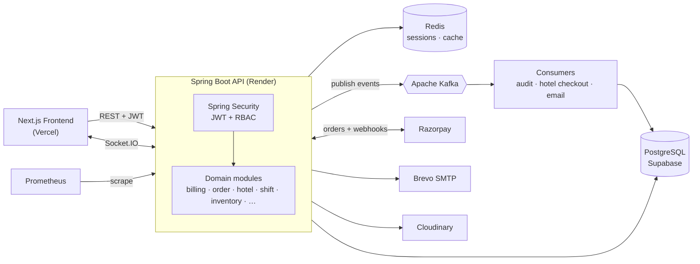
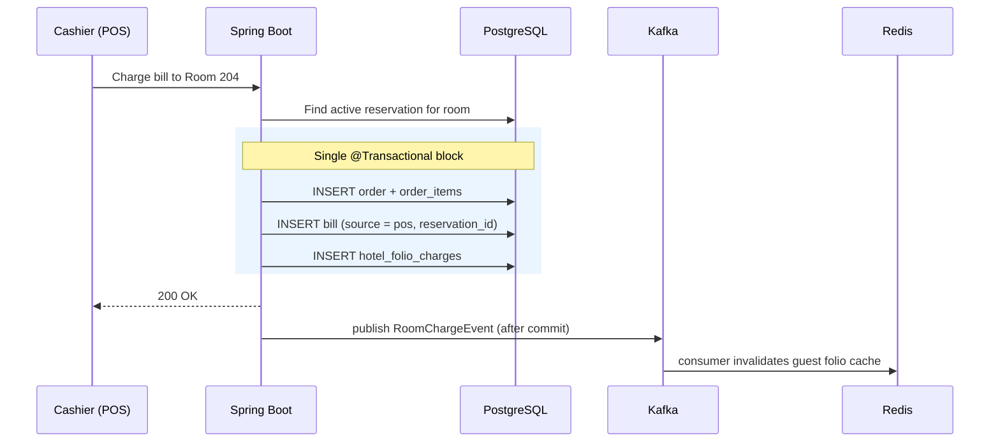
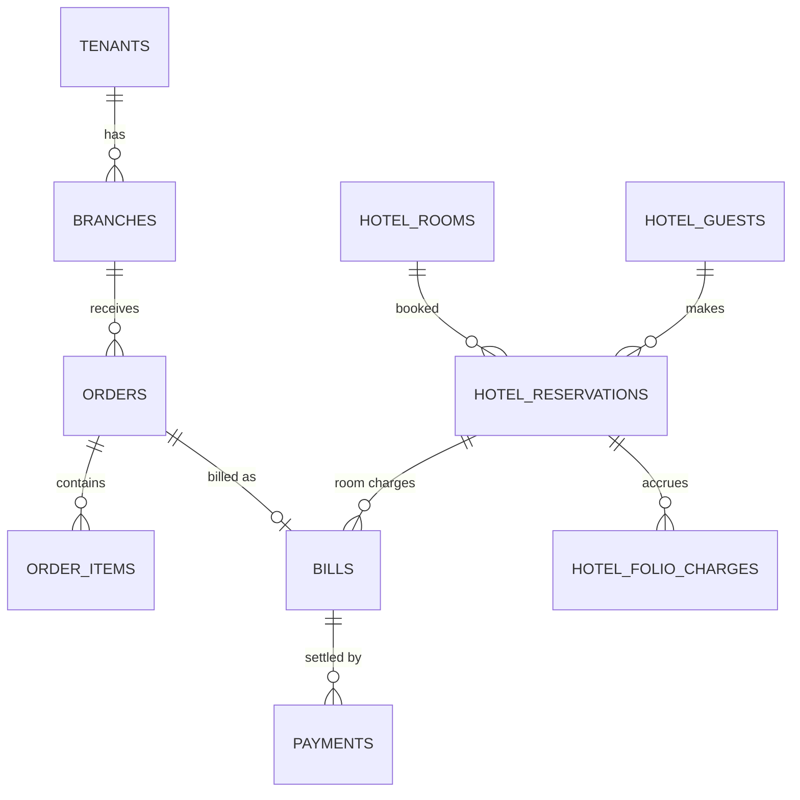

<div align="center">

# 🍽️🏨 Dine&Stay OS — Backend API

**A multi-tenant SaaS platform that unifies Restaurant POS and Hotel Property Management in one system.**

Spring Boot · PostgreSQL · Redis · Apache Kafka · Razorpay · Socket.IO

[](https://dine-stay-os-frontend.vercel.app/)
[](https://dinestay-backend-dubd.onrender.com/swagger-ui/index.html)
[](https://github.com/anshuman-borah/Dine-Stay-OS-frontend)


</div>

---

## 🎬 Demo

<!-- Replace with your screenshot: put the file at docs/screenshot.png -->
<p align="center">
  
</p>

<p align="center">
  <a href="https://youtu.be/m9O6sO0luzw"><b>▶️ Watch the full demo video</b></a>
</p>

---

## 🌐 Live Environment

| Resource | Link |
|---|---|
| 🖥️ **Web App (Frontend)** | [dine-stay-os-frontend.vercel.app](https://dine-stay-os-frontend.vercel.app/) |
| 📖 **API Docs (Swagger UI)** | [/swagger-ui/index.html](https://dinestay-backend-dubd.onrender.com/swagger-ui/index.html) |
| 📊 **Metrics (Prometheus)** | [/actuator/prometheus](https://dinestay-backend-dubd.onrender.com/actuator/prometheus) |
| 🏥 **Health Check** | [/actuator/health](https://dinestay-backend-dubd.onrender.com/actuator/health) |
| 💻 **Frontend Repository** | [Dine-Stay-OS-frontend](https://github.com/anshuman-borah/Dine-Stay-OS-frontend) |

> ⏳ **Note:** the backend runs on Render's free tier and sleeps when idle. The first request after inactivity can take ~30–60 seconds while the container wakes up.

---

## ✨ What It Does

Dine&Stay OS lets a restaurant or hotel business run **everything from one platform**: billing, kitchen, inventory, rooms, guests, shifts and subscriptions, with strict data isolation between tenants (businesses) and branches.

### 🍴 Restaurant & POS
- **Orders & Billing:** dine-in / takeaway / delivery orders, split payments (cash, card, UPI, wallet), discounts, voids, refunds, complimentary and sales-return flows
- **GST engine:** per-item GST slabs with HSN codes, automatic CGST/SGST vs IGST supply-type handling, round-off, and GST summaries on every invoice
- **Kitchen Display System (KDS):** items stream to kitchen stations in real time over Socket.IO, with acknowledged / ready timestamps
- **Menu management:** categories, variations, modifier groups, add-ons, veg/non-veg, per-item tax rates
- **Table management:** sections, floor layout positions, QR codes, live table status
- **Inventory:** stock ledger with running balance, reorder levels, and optional stock tracking per menu item
- **Shift management:** opening/closing cash with **currency denomination counts**, expected-vs-actual cash difference, per-method sales totals

### 🏨 Hotel / Property Management (PMS)
- **Rooms & room types:** inventory, rates, occupancy, amenities, floors, live room status
- **Guests & reservations:** full reservation lifecycle (confirm → check-in → check-out / cancel), advance payments, balance due, booking sources
- **Housekeeping:** task types, priorities, assignment and status tracking, auto-generated on checkout
- **Guest folio:** every charge posted against a reservation, producing one unified final invoice
- **Channel manager webhooks:** inbound booking sync from OTAs/channel managers
- **🔗 Charge-to-Room:** a restaurant bill can be posted atomically to an in-house guest's folio (see below)

### 🏢 SaaS Platform
- **Multi-tenancy** with multi-branch support and per-branch timezone / currency
- **Subscriptions & plans** with trial periods, limits (branches, users, menu items) and **Razorpay** checkout + signature verification
- **Super-admin panel APIs:** tenants, plans, subscriptions, payments, platform activity
- **Audit trail:** who changed what, with before/after values, IP and user agent
- **Transactional email** (Brevo SMTP): receipts, password reset, reports

---

## 🏗️ Architecture



The backend is a **modular monolith**: each business domain lives in its own package (`controller → service → repository → entity → dto`), which keeps boundaries clean and makes individual modules easy to extract later.

### 🔗 Charge-to-Room: a cross-module transaction



If any step fails, the whole transaction rolls back, so no orphaned POS bills and no missing folio charges. The event is published only **after commit**, so downstream consumers never see data that was rolled back.

---

## 🧰 Tech Stack

| Layer | Technology |
|---|---|
| **Language / Framework** | Java 17+, Spring Boot 3, Spring MVC, Spring Data JPA (Hibernate) |
| **Security** | Spring Security, JWT access + refresh tokens, role-based access control |
| **Database** | PostgreSQL (Supabase), 33 relational tables, JSONB for flexible settings |
| **Caching / Sessions** | Redis |
| **Messaging** | Apache Kafka (async audit logging, hotel checkout, notifications) |
| **Real-time** | Socket.IO + WebSocket (KDS, live order updates) |
| **Payments** | Razorpay (orders, checkout verification, webhooks) |
| **Email** | Brevo SMTP relay |
| **File Storage** | Cloudinary |
| **API Docs** | OpenAPI / Swagger UI |
| **Observability** | Spring Boot Actuator, Micrometer, Prometheus |
| **DevOps** | Docker, Docker Compose, Render (backend), Vercel (frontend) |

---

## 📚 API Documentation

Interactive OpenAPI docs are served by the running application:

- **Live:** https://dinestay-backend-dubd.onrender.com/swagger-ui/index.html
- **Local:** http://localhost:4000/swagger-ui/index.html

Authenticate via `POST /auth/login`, copy the JWT, click **Authorize** in Swagger UI, and you can call any protected endpoint.

---

## 📊 Observability

The service exposes production-style telemetry through Spring Boot Actuator and Micrometer:

| Endpoint | Purpose |
|---|---|
| `/actuator/health` | Liveness + database / Redis connectivity |
| `/actuator/prometheus` | JVM memory, GC, threads, HTTP request latency & counts, datasource pool |

A ready-to-use [`prometheus.yml`](./prometheus.yml) is included in the repo to scrape the service locally.

---

## 🗄️ Data Model

33 tables organised by domain. Every business table carries `tenant_id` (and `branch_id` where relevant) to enforce multi-tenant isolation.

| Domain | Tables |
|---|---|
| **Platform** | `tenants`, `branches`, `plans`, `subscriptions`, `users`, `password_reset_tokens`, `audit_logs` |
| **Menu** | `categories`, `menu_items`, `menu_item_variations`, `modifier_groups`, `modifiers`, `menu_item_modifiers`, `addon_groups`, `addons`, `menu_item_addons`, `gst_rates` |
| **POS** | `table_sections`, `tables`, `orders`, `order_items`, `bills`, `payments` |
| **Shifts** | `shifts`, `shift_denominations` |
| **Inventory** | `inventory_items`, `inventory_transactions` |
| **Hotel** | `hotel_room_types`, `hotel_rooms`, `hotel_guests`, `hotel_reservations`, `hotel_folio_charges`, `hotel_housekeeping_tasks` |



> Schema is managed outside Hibernate (`spring.jpa.hibernate.ddl-auto=none`) so production data is never altered by application startup.

---

## 📁 Project Structure

```
src/main/java/project/EnterpriseSaas/demo/
├── common/          # ApiResponse, enums, global exception handler, utilities
├── config/          # Security, Redis, Scheduling, Socket.IO, WebSocket, MVC
├── security/        # JWT filter, JWT service, UserDetailsService
└── modules/
    ├── admin/  audit/  auth/  billing/  branch/  core/
    ├── hotel/       # reservations, rooms, folio, housekeeping, channel-manager webhooks, Kafka consumers
    ├── inventory/  kds/  menu/  order/  plan/
    ├── razorpay/  reports/  shift/  storage/
    └── subscription/  table/  tenant/  user/
```

---

## 🚀 Getting Started

### Prerequisites
- Java 17+
- A PostgreSQL database (Supabase or local)
- Redis (local or Docker)
- *(Optional)* Docker, for local Redis / Kafka

### 1. Clone

```bash
git clone <this-repository-url>
cd <repository-folder>
```

### 2. Configure environment variables

| Variable | Description |
|---|---|
| `SPRING_DATASOURCE_URL` | JDBC URL of your PostgreSQL database |
| `SPRING_DATASOURCE_USERNAME` | Database user |
| `SPRING_DATASOURCE_PASSWORD` | Database password |
| `SPRING_DATA_REDIS_URL` | e.g. `redis://localhost:6379` |
| `APP_JWT_SECRET` | Secret for signing access tokens |
| `APP_JWT_REFRESH_SECRET` | Secret for signing refresh tokens |
| `RAZORPAY_KEY_SECRET` | Razorpay secret (use **Test Mode** keys locally) |
| `SPRING_MAIL_USERNAME` / `SPRING_MAIL_PASSWORD` | Brevo SMTP credentials |
| `CLOUDINARY_CLOUD_NAME` / `CLOUDINARY_API_KEY` / `CLOUDINARY_API_SECRET` | Image uploads |
| `APP_SUPERADMIN_EMAIL` / `APP_SUPERADMIN_PASSWORD` | Bootstrap platform super-admin |
| `KAFKA_ENABLED` | `true` to enable the event pipeline (default `false`) |
| `SPRING_KAFKA_LISTENER_AUTO_STARTUP` | `true` to start Kafka consumers (default `false`) |

### 3. Start supporting services (optional)

```bash
docker compose up -d
```

### 4. Run the API

```bash
./mvnw spring-boot:run
```

The API starts on **http://localhost:4000** and Swagger UI is available at `/swagger-ui/index.html`.

### 5. Run the frontend

Follow the instructions in the [frontend repository](https://github.com/anshuman-borah/Dine-Stay-OS-frontend) and point `NEXT_PUBLIC_API_URL` at `http://localhost:4000`.

---

## ⚙️ Feature Flags

| Property | Default | Effect |
|---|---|---|
| `app.features.multi-branch` | `true` | Enables multi-branch tenancy |
| `app.features.hotel-module` | `true` | Enables the hotel / PMS module |
| `app.kafka.enabled` | `false` | Event streaming is opt-in so the API still runs on hosts without a broker |

---

## 🔐 Security Highlights

- Stateless **JWT** authentication with short-lived access tokens (15 min) and rotating refresh tokens (7 days)
- Role-based access control across cashier, waiter, owner, platform super-admin and more
- Every query scoped by **tenant** and **branch** — one business can never read another's data
- **Razorpay webhook signature verification** before any payment is marked as paid
- Passwords hashed; password-reset uses hashed, expiring, single-use tokens
- Full **audit log** of sensitive actions
- Secrets supplied via environment variables, never committed

---

## 🐳 Deployment

| Component | Platform |
|---|---|
| Backend API | Render (Docker, see [`Dockerfile`](./Dockerfile) and [`render.yaml`](./render.yaml)) |
| Frontend | Vercel |
| Database | Supabase (PostgreSQL) |

---

## 👤 Author

**Anshuman Borah**

- GitHub: [@anshuman-borah](https://github.com/anshuman-borah)
- Frontend repo: [Dine-Stay-OS-frontend](https://github.com/anshuman-borah/Dine-Stay-OS-frontend)

---

<div align="center">
⭐ If you found this project interesting, consider giving it a star!
</div>
